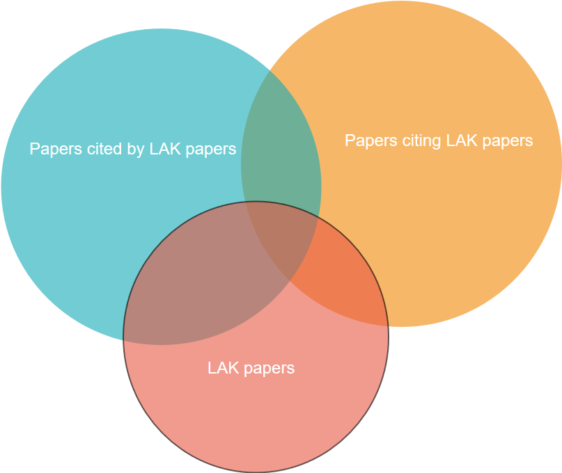

# Datasets

This dataset was retrieved from [Microsoft Academic Graph](https://www.microsoft.com/en-us/research/project/microsoft-academic-graph/) (MAG). 
MAG contains scientific contains interlinked information about publication records, citations, 
and further information about authors, institutions, journals, conferences, and fields of study. 

The data is based on papers presented at the [Learning Analytics and Knowledge](https://solaresearch.org/events/lak/) (LAK) conferences, 
which are taking place annually since 2011.

The dataset was retrieved in the following way:
1. The initial set of papers were all papers ever published at LAK since 2011 were retrieved from MAG.
2. The set of papers was expanded by all papers cited by LAK papers.
3. The set of papers was further expanded by all papers citing at least one LAK paper.
4. All citation relationships between the set of papers were retrieved. 

The covered scope of papers can be depicted as follows:

The files are in tab separated format (TSV).

### lak_papers.tsv
This file contains full information about all papers in the dataset in the following format:

| Paper id | Title | Year | Venue | Abstract (as json) |

For legal reasons the Microsoft Academic Grpah publishes abstracts only as [inverted index](https://en.wikipedia.org/wiki/Inverted_index)

### lak_citations.tsv

| Citing paper id | Cited paper id |

### lak_authors.tsv
Author information about the papers in the dataset.

| Paper id | Author id | Author name |
